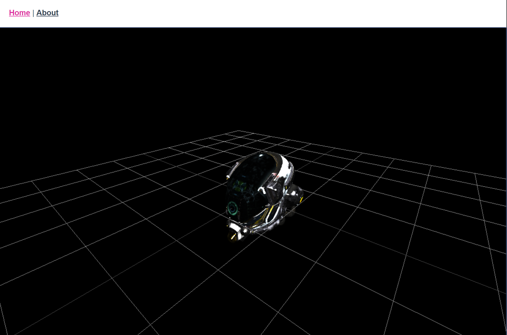

# vue-threejs-template

The is a starter template for a website that uses Vuejs and Threejs. It sets up an initial threejs canvas and manages loading and 3d model from a vuex store.

### Links
See [Vuejs](https://www.vuejs.org/).
See [Threejs](https://https://threejs.org/).

### Screenshot

